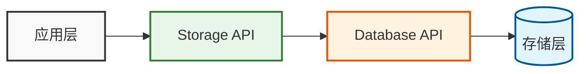
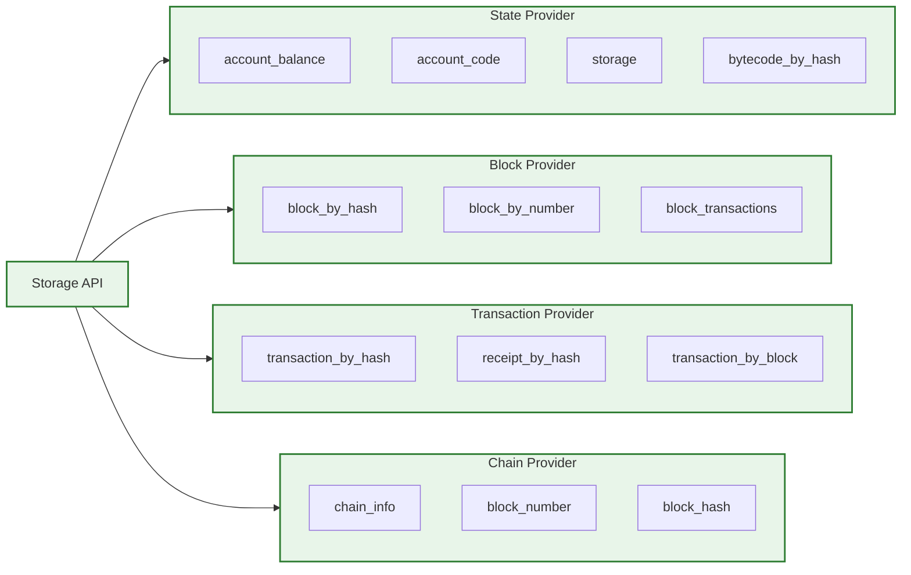
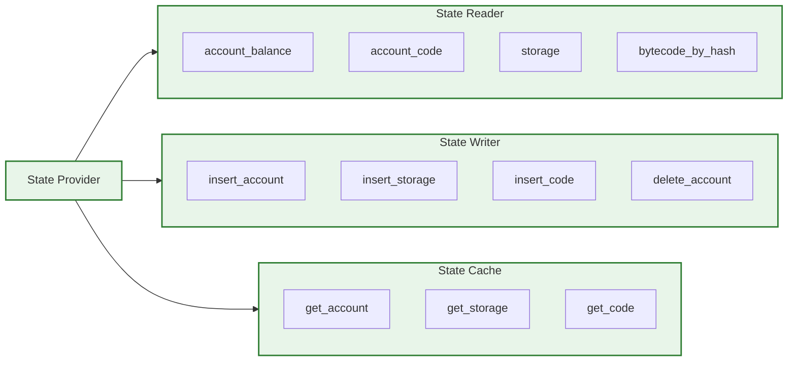
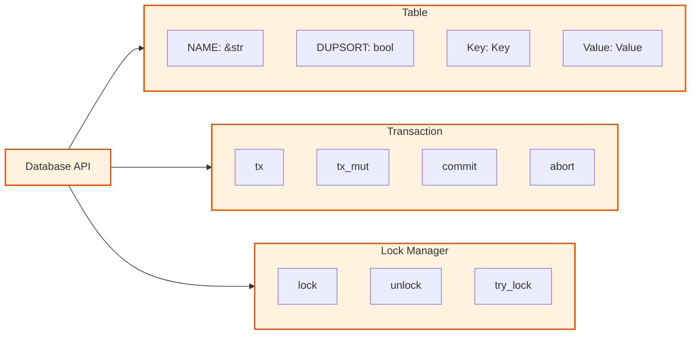
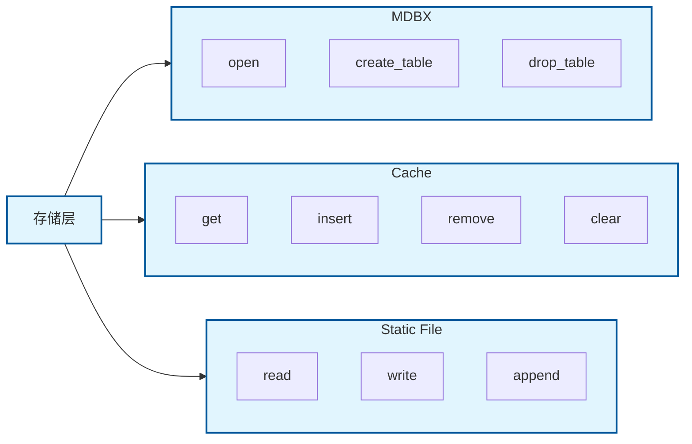

# Reth Storage 存储层设计

## 1. 概述

Reth 存储层是一个高性能、模块化的以太坊数据存储解决方案。它采用分层架构设计，实现了数据访问的抽象和具体存储的分离，同时提供了丰富的功能和优秀的性能。

在接下来的内容中，我们将依次介绍各个核心层次的设计理念、主要接口和它们之间的协作关系，帮助你系统理解 Reth 存储系统的整体架构。

### 1.1 核心特点

- 分层架构：清晰的层次划分，职责分明
- 高性能：优化的数据访问和存储机制
- 可扩展：模块化设计，易于扩展
- 可靠性：完善的事务和并发控制
- 可维护：清晰的代码组织和文档

### 1.2 整体架构



---

## 2. 核心组件

下面结合模块架构图，依次介绍各核心层次的设计与接口。

在整体架构的基础上，Reth 存储系统将核心功能分为四大层次。下面我们将依次展开介绍。

### 2.1 存储 API 层 (storage-api)



首先，最上层的 Storage API 层为上层模块（如 RPC、同步、执行等）提供了统一、类型安全的数据访问接口。它屏蔽了底层实现细节，使开发者可以专注于业务逻辑。

1. 状态管理
   - `StateProvider`: 状态数据访问
   - `StateWriter`: 状态数据写入
   - `StateReader`: 状态数据读取

2. 区块管理
   - `BlockProvider`: 区块数据访问
   - `BlockWriter`: 区块数据写入
   - `HeaderProvider`: 区块头管理

3. 交易管理
   - `TransactionsProvider`: 交易数据访问
   - `ReceiptsProvider`: 收据数据访问
   - `WithdrawalsProvider`: 提款数据访问

4. 链管理
   - `ChainProvider`: 链数据访问
   - `ChainInfo`: 链信息管理
   - `HistoryProvider`: 历史数据访问

#### 2.1.1 storage-api 主要 trait 与接口

Reth 的 `storage-api` 层定义了以太坊节点存储访问的核心 trait 和类型，是上层与底层存储实现解耦的关键。其主要特性和接口如下：

##### 1. 统一抽象与分层设计
- 通过 trait 抽象区块、状态、交易、链、收据、历史、哈希、trie 等多种数据访问与写入接口。
- 支持只读/读写、历史/最新/裁剪等多种访问模式。
- 便于 provider 层、db-api 层和具体存储实现的解耦与组合。

##### 2. 主要 trait 及功能
- `StateProvider`/`StateProviderFactory`：统一的状态访问与工厂接口，支持最新、历史、pending 状态的获取。
- `BlockReader`/`BlockWriter`：区块数据的读取与写入，支持多种来源（数据库、pending、canonical）。
- `HeaderProvider`：区块头访问，支持 hash/number/tag 多种定位方式。
- `TransactionsProvider`/`ReceiptProvider`：交易与收据的高效访问。
- `AccountReader`/`StorageReader`：账户与存储槽的访问，支持批量与变更集。
- `TrieWriter`/`StateRootProvider`/`StorageRootProvider`：trie 相关操作与状态根计算。
- `HistoryWriter`/`HashingWriter`：历史索引与哈希表的维护。
- `FullRpcProvider`：组合所有核心 trait，便于 RPC 层依赖。

##### 3. 类型安全与可扩展性
- 所有 trait 强类型约束，接口清晰，便于静态检查和 IDE 自动补全。
- 支持 auto_impl，便于 Arc/Box/引用等多种包装。
- trait 组合灵活，便于扩展和 mock 测试。

##### 4. 典型用法

```rust
// 获取最新状态 provider
let state_provider = StateProviderFactory::latest()?;
// 查询账户余额
let balance = state_provider.account_balance(&address)?;
// 查询区块
let block = block_reader.block_by_number(1000)?;
// 写入区块
block_writer.insert_block(block, StorageLocation::Database)?;
// 计算状态根
let state_root = state_provider.state_root(hashed_state)?;
```

##### 5. 设计亮点
- 统一 trait 抽象，便于多后端实现和切换
- 支持历史/裁剪/最新等多种状态视图
- 类型安全、易于测试和扩展
- 与 provider/db-api 层协作紧密，支撑高性能和灵活的以太坊节点存储

**结论**：storage-api 层是 Reth 存储系统的"接口规范层"，通过 trait 组合和类型系统，极大提升了系统的灵活性、可维护性和性能，是理解 Reth 存储架构的基础。

### 2.2 Provider 层核心接口与功能



紧接着，Provider 层作为"服务接口层"，在 storage-api trait 的基础上，聚合了多种数据源（数据库、静态文件、内存 overlay、裁剪/历史等），为上层提供一致的数据视图。

#### 1. ProviderFactory
- 管理数据库、静态文件、链配置等，生成只读/读写 provider。
- 支持多后端、裁剪、metrics、可插拔。

#### 2. DatabaseProvider
- 封装事务，统一实现区块、交易、账户、状态等多种数据访问和写入接口。
- 支持只读/读写、历史/最新、裁剪/非裁剪等多种模式。

#### 3. BlockchainProvider
- 区块链全局视图入口，聚合数据库、内存 overlay、forkchoice 状态等。
- 实现所有核心数据访问 trait，支持一致性视图和多种状态访问。

#### 4. StateProvider/LatestStateProviderRef/HistoricalStateProviderRef
- 状态访问统一 trait，支持"最新状态"和"历史状态"两种模式。
- 历史 provider 支持裁剪感知，能优雅处理被裁剪的历史区块。

#### 5. FullProvider trait
- 组合所有 provider trait，便于上层依赖"全功能 provider"。

#### 6. 典型用法

```rust
// 获取 provider
let provider = provider_factory.provider()?;
// 区块头、区块、交易、账户访问
let header = provider.header_by_number(1000)?;
let block = provider.block(BlockHashOrNumber::Number(1000))?;
let tx = provider.transaction_by_hash(tx_hash)?;
let account = provider.basic_account(&address)?;

// 状态访问
let state_provider = provider_factory.latest()?;
let historical_provider = provider_factory.history_by_block_number(9000000)?;

// 写入与回滚
let mut provider_rw = provider_factory.provider_rw()?;
provider_rw.insert_block(block, StorageLocation::Database)?;
provider_rw.remove_state_above(block_number, StorageLocation::Database)?;
```

#### 7. 设计优势
- 统一接口、多后端支持、裁剪与历史感知、类型安全、可扩展性、高性能。

**结论**：Provider 层是 Reth 存储系统的"服务接口层"，通过 trait 组合和泛型，极大提升了系统的灵活性、可维护性和性能，是理解 Reth 存储架构的关键一环。

### 2.2 数据库抽象层 (db-api)



在 Provider 层之下，db-api 层承担着"数据库抽象层"的角色。它屏蔽了具体数据库实现（如 MDBX），为上层提供类型安全、事务化的表操作接口。

#### 2.2.1 db-api 主要 trait 与接口

Reth 的 `db-api` 层定义了底层数据库的抽象接口，是存储实现与上层 provider/storage-api 解耦的关键。其主要特性和接口如下：

##### 1. 事务与表抽象
- `Database` trait：数据库主接口，支持只读/读写事务（`tx`/`tx_mut`），并提供事务生命周期管理（`view`/`update`）。
- `DbTx`/`DbTxMut`：只读/读写事务抽象，支持表的读写、游标遍历、提交/回滚等。
- `Table` trait：表结构抽象，定义表名、是否 DUPSORT、Key/Value 类型。
- `DupSort` trait：支持一对多（重复 key）表。

##### 2. 游标与遍历
- `DbCursorRO`/`DbCursorRW`：表的只读/读写游标，支持 seek/next/prev/first/last 等操作。
- `Walker`/`RangeWalker`/`ReverseWalker`/`DupWalker`：基于游标的高效遍历与批量操作。

##### 3. 序列化与压缩
- `Encode`/`Decode` trait：Key 的序列化与反序列化。
- `Compress`/`Decompress` trait：Value 的压缩与解压缩，支持多种编码格式（如 Compact、Scale、RoaringBitmap）。
- 支持自定义表模型（如 ShardedKey、StorageShardedKey、IntegerList 等）。

##### 4. 类型安全与可扩展性
- 所有 trait 强类型约束，接口清晰，便于静态检查和 IDE 自动补全。
- 支持 mock 数据库（`DatabaseMock`），便于测试。
- trait 组合灵活，便于扩展和多后端实现。

##### 5. 典型用法

```rust
// 打开数据库并开启只读事务
let db: Arc<dyn Database> = ...;
let tx = db.tx()?;
// 读取表数据
let value = tx.get::<MyTable>(key)?;
// 使用游标遍历表
let mut cursor = tx.cursor_read::<MyTable>()?;
while let Some((k, v)) = cursor.next()? {
    // 处理 k, v
}
// 写入事务
let mut tx_mut = db.tx_mut()?;
tx_mut.put::<MyTable>(key, value)?;
tx_mut.commit()?;
```

##### 6. 设计亮点
- 事务安全、强一致性，所有操作都在事务内完成
- 支持高效批量遍历与范围操作
- 多种表模型和压缩格式，兼容以太坊多样数据结构
- 类型安全、易于测试和扩展
- 与 storage-api/provider 层协作紧密，支撑高性能和灵活的以太坊节点存储

**结论**：db-api 层是 Reth 存储系统的"数据库抽象层"，通过事务、表、游标、序列化等 trait 组合，极大提升了系统的灵活性、可维护性和性能，是理解 Reth 存储架构的核心基础。

### 2.3 存储实现层 (db)



最后，存储实现层提供了具体的存储后端实现（如 MDBX、静态文件、缓存等），支撑了高性能和多样化的存储需求。它实现了 db-api trait，供上层调用。

## 3. 关键特性

在上述分层架构的基础上，Reth 存储系统还具备如下关键特性：

### 3.1 性能优化

1. 数据压缩
   - ZSTD 压缩支持
   - 自定义压缩算法
   - 压缩级别可配置

2. 缓存机制
   - 多级缓存
   - LRU 缓存策略
   - 预加载机制

3. 批量操作
   - 批量读取
   - 批量写入
   - 事务批处理

### 3.2 可靠性保证

1. 事务支持
   - ACID 特性
   - 事务隔离
   - 原子操作

2. 并发控制
   - 文件锁机制
   - 读写锁
   - 死锁预防

3. 错误处理
   - 统一错误类型
   - 错误传播链
   - 错误恢复机制

### 3.3 可扩展性

1. 模块化设计
   - 接口抽象
   - 实现分离
   - 插件化架构

2. 存储引擎
   - MDBX 支持
   - 静态文件支持
   - 可扩展接口

3. 数据模型
   - 灵活的表结构
   - 自定义编码
   - 版本兼容

## 4. 使用示例

通过前面的分层讲解，我们可以看到各层 trait 和接口如何协作。下面给出一些典型的使用场景代码片段，帮助理解实际开发中的调用方式。

### 4.1 基本操作

```rust
// 创建状态提供者
let state_provider = StateProviderFactory::latest()?;

// 查询账户信息
let balance = state_provider.account_balance(&address)?;
let code = state_provider.account_code(&address)?;

// 查询存储数据
let storage = state_provider.storage(address, storage_key)?;
```

### 4.2 历史数据访问

```rust
// 获取历史状态
let historical_state = state_provider.history_by_block_number(block_number)?;

// 获取待处理状态
let pending_state = state_provider.pending()?;
```

## 5. 最佳实践

结合实际开发经验，推荐如下最佳实践以充分发挥 Reth 存储系统的性能和可靠性：

### 5.1 状态访问
- 优先使用批量操作
- 合理使用缓存
- 注意错误处理

### 5.2 数据写入
- 使用事务保证原子性
- 注意并发安全
- 合理使用批量写入

### 5.3 性能优化
- 使用适当的索引
- 避免重复查询
- 合理使用缓存

## 6. 总结

综上所述，Reth 存储层设计展示了以下特点：

1. 高度模块化：清晰的层次结构和职责划分
2. 类型安全：强类型系统和编译时检查
3. 性能优化：多级缓存和压缩机制
4. 可扩展性：灵活的接口和实现分离
5. 可靠性：完善的事务和并发控制
6. 可维护性：清晰的代码组织和文档

这些设计使得 Reth 能够高效地处理以太坊节点所需的各种数据存储需求，同时保证了系统的可靠性和可维护性。存储 API 的设计特别注重模块化和可扩展性，使得系统能够轻松适应不同的存储需求和性能要求。