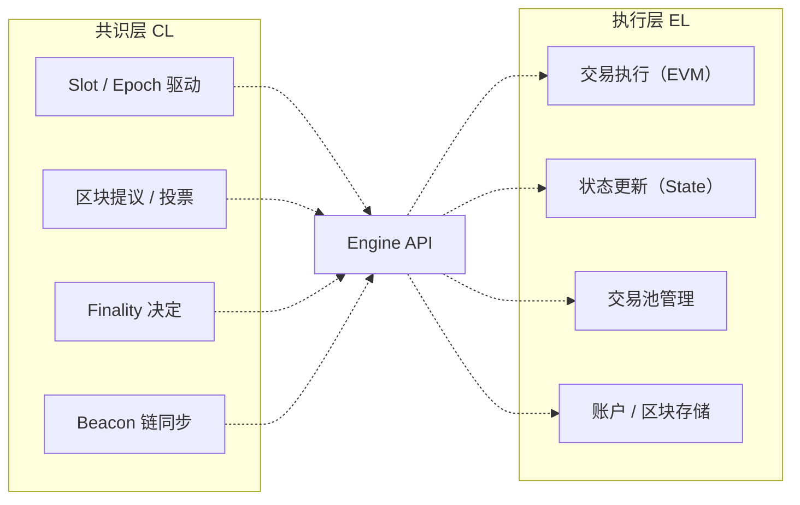

# Reth 存储层源码走读

### Reth 是什么？

Reth is an **Execution Layer (EL)** and is compatible with all Ethereum **Consensus Layer (CL)** implementations that support the **Engine API**.

在以太坊 The Merge 之后，节点分成了两个部分，其中部分负责共识，另部分负责状态维护。




### 以太坊的状态

- 区块

  - 区块头
  - 区块体
- 链

  - 父叔
  - 高度
- 账户状态 [MPT]

  - balance

### 共识层通过 EngineAPI 调用执行层，那么 Engine API 有哪些语义？

- <a href="https://github.com/ethereum/execution-apis/blob/a0d03086564ab1838b462befbc083f873dcf0c0f/src/engine/paris.md">Paris</a>
- <a href="https://github.com/ethereum/execution-apis/blob/a0d03086564ab1838b462befbc083f873dcf0c0f/src/engine/shanghai.md">Shanghai</a>
- <a href="https://github.com/ethereum/execution-apis/blob/a0d03086564ab1838b462befbc083f873dcf0c0f/src/engine/cancun.md">Cancun</a>

<table>
<tr>
<td>方法名<br/></td><td>用途<br/></td><td>场景<br/></td></tr>
<tr>
<td>engine_newPayloadVx<br/></td><td>提交一个新区块给执行层<br/></td><td>共识层接收到区块头（比如来自其他节点）<br/></td></tr>
<tr>
<td>engine_forkchoiceUpdatedVx<br/></td><td>告诉执行层哪个区块是链头<br/></td><td>切换链头、出块前、同步时<br/></td></tr>
<tr>
<td>engine_getPayloadVx<br/></td><td>要求执行层构造一个新区块<br/></td><td>共识层要提议新区块（出块）时<br/></td></tr>
<tr>
<td>engine_exchangeTransitionConfiguration<br/></td><td>启动时交换合并配置<br/><br/></td><td>共识客户端刚启动时<br/></td></tr>
<tr>
<td>engine_getPayloadBodies<br/>- ByHash<br/>- ByRange<br/></td><td>请求区块体（交易列表）<br/><br/></td><td>共识节点快速同步时<br/><br/></td></tr>
</table>

### 为了实现 Engine API 的语义，执行层要有哪些能力？

<table>
<tr>
<td>方法名<br/></td><td>数据<br/></td><td>能力<br/></td></tr>
<tr>
<td>engine_newPayloadVx<br/></td><td>- 链头<br/>- 账户状态<br/></td><td>- 获取当前链头<br/>- 通过账户ID获取账户状态<br/>- 记录临时状态<br/></td></tr>
<tr>
<td>engine_forkchoiceUpdatedVx<br/></td><td>- 历史某一个区块<br/></td><td>- 更新链的头部状态 [最高的链]<br/>- 快速切换/回滚到不同的链<br/>- 维护 finalized/safe block<br/></td></tr>
<tr>
<td>engine_getPayloadVx<br/></td><td>- 链头<br/>- 账户状态<br/></td><td>- 构建新区块<br/>- 获取当前链头<br/>- 快速生成 block header/body<br/></td></tr>
<tr>
<td>engine_exchangeTransitionConfiguration<br/></td><td>- 配置项<br/><br/></td><td><br/></td></tr>
<tr>
<td>engine_getPayloadBodies<br/>- ByHash<br/>- ByRange<br/></td><td>- 链头<br/>- 链高度<br/>- 链哈希<br/></td><td>- 通过哈希定位一个块<br/>- 通过高度范围定位一系列块<br/></td></tr>
</table>

### Reth [执行层] = 逻辑层 + 存储层，存储层给逻辑层暴露了哪些能力？怎么样暴露的？

#### 怎么样暴露的 ？

- Reth 中 BlockchainProvider 作为整个存储层的门户。

#### 暴露了哪些能力 ？

- 实现了 数据结构的 Trait + 链状态的 Trait 【门面模式】，将存储的能力暴露给逻辑层。
  - Header
  - Block
  - Receipts
  - State
    - Latest
    - by_block_num
    - by_block_hash

```rust
crates/storage/provider/src/providers/blockchain_provider.rs

/// The main type for interacting with the blockchain.
///
/// This type serves as the main entry point for interacting with the blockchain and provides data
/// from database storage and from the blockchain tree (pending state etc.) It is a simple wrapper
/// type that holds an instance of the database and the blockchain tree.
#[derive(Debug)]
pub struct BlockchainProvider<N: NodeTypesWithDB> {
    /// Provider factory used to access the database.
    pub(crate) database: ProviderFactory<N>,
    /// Tracks the chain info wrt forkchoice updates and in memory canonical
    /// state.
    pub(crate) canonical_in_memory_state: CanonicalInMemoryState<N::Primitives>,
}
```

<table>
<tr>
<td>字段<br/></td><td>类型<br/></td><td>作用<br/></td><td>服务对象<br/></td></tr>
<tr>
<td>database<br/><br/></td><td>ProviderFactory<N><br/></td><td>持久化层的访问接口<br/>- mdbx<br/>- static_file<br/></td><td>历史数据访问<br/></td></tr>
<tr>
<td>canonical_in_memory_state<br/></td><td>CanonicalInMemoryState<br/></td><td>管理和缓存当前主链的内存状态，包括：<br/>- 当前的 <b>pending block</b><br/>- 当前的 <b>head block</b><br/>- 当前的 <b>finalized block</b><br/>- 当前的 <b>safe block</b><br/></td><td>- 验证区块<br/>- 更新链头<br/>- 产生区块<br/></td></tr>
</table>

### 内存中管理的 Block

<table>
<tr>
<td>名称<br/></td><td>定义<br/></td><td>特性<br/></td></tr>
<tr>
<td>Head Block<br/></td><td>当前 forkchoice 算法选出的主链 tip 区块，是执行引擎所“跟随”的最新区块<br/></td><td>- 最前沿/高的合法块<br/>- 可能被重组<br/>- 实时<br/></td></tr>
<tr>
<td>Safe Block<br/></td><td>被所有 honest validator 知晓、投票支持的区块，虽然未 final，但几乎不会 reorg<br/></td><td>- 大概率不会被重组<br/>- 尚未最终确定<br/></td></tr>
<tr>
<td>Finalized Block<br/><br/></td><td>被 >2/3 超级多数 validator 通过 Casper FFG 投票<b>最终确定</b>的区块<br/></td><td>- 永不可重组<br/>- 状态可裁剪<br/>- 滞后几个 epoch<br/></td></tr>
<tr>
<td>Pending Block<br/><br/></td><td><b>还未被正式打包并广播到区块链上的下一个候选区块</b>，由以太坊节点本地构建，包含已知合法但尚未上链的交易。<br/></td><td>- 未上链<br/>- 可能被丢弃<br/>- 模拟<br/></td></tr>
</table>

### 通过 canonical_in_memory_state 访问了哪些接口

#### BlockNumReader

```rust
impl<N: ProviderNodeTypes> BlockNumReader for BlockchainProvider<N> {
    fn chain_info(&self) -> ProviderResult<ChainInfo> {
        Ok(self.canonical_in_memory_state.chain_info())
    }

    fn best_block_number(&self) -> ProviderResult<BlockNumber> {
        Ok(self.canonical_in_memory_state.get_canonical_block_number())
    }

    fn last_block_number(&self) -> ProviderResult<BlockNumber> {
        self.database.last_block_number()
    }

    fn block_number(&self, hash: B256) -> ProviderResult<Option<BlockNumber>> {
        self.consistent_provider()?.block_number(hash)
    }
}
```

<table>
<tr>
<td>方法名<br/></td><td>数据源<br/></td><td>原因<br/></td></tr>
<tr>
<td>`chain_info()`<br/></td><td>`canonical_in_memory_state`<br/></td><td>主链状态缓存，可快速返回<br/></td></tr>
<tr>
<td>`best_block_number()`<br/></td><td>`canonical_in_memory_state`<br/></td><td>最新同步高度，在 forkchoice 更新时写入<br/></td></tr>
<tr>
<td>`last_block_number()`<br/></td><td>`database`<br/></td><td>实际持久化层中最后一个区块号<br/></td></tr>
<tr>
<td>`block_number(hash)`<br/></td><td>`consistent_provider`（数据库）<br/></td><td>反查，没有维护在内存里，只能查表<br/></td></tr>
</table>

#### BlockIdReader

```rust
impl<N: ProviderNodeTypes> BlockIdReader for BlockchainProvider<N> {
    fn pending_block_num_hash(&self) -> ProviderResult<Option<BlockNumHash>> {
        Ok(self.canonical_in_memory_state.pending_block_num_hash())
    }

    fn safe_block_num_hash(&self) -> ProviderResult<Option<BlockNumHash>> {
        Ok(self.canonical_in_memory_state.get_safe_num_hash())
    }

    fn finalized_block_num_hash(&self) -> ProviderResult<Option<BlockNumHash>> {
        Ok(self.canonical_in_memory_state.get_finalized_num_hash())
    }
}
```

<table>
<tr>
<td>状态类型<br/></td><td>含义<br/></td><td>更新频率<br/></td><td>使用场景<br/></td></tr>
<tr>
<td>`pending`<br/></td><td>正在构建但未打包的区块（如打包交易）<br/></td><td>非常频繁<br/></td><td>出块者构造区块时使用<br/></td></tr>
<tr>
<td>`safe`<br/></td><td>被大多数节点认为“短期内不会被重组”的区块<br/></td><td>同步期间频繁更新<br/></td><td>提供相对稳定视图<br/></td></tr>
<tr>
<td>`finalized`<br/></td><td>绝大多数网络认为“永不回滚”的区块<br/></td><td>较稳定，偶尔更新<br/></td><td>对外暴露、存档数据<br/></td></tr>
</table>

#### BlockReader

```rust
impl<N: ProviderNodeTypes> BlockReader for BlockchainProvider<N> {
    type Block = BlockTy<N>;

    fn find_block_by_hash(
        &self,
        hash: B256,
        source: BlockSource,
    ) -> ProviderResult<Option<Self::Block>> {
        self.consistent_provider()?.find_block_by_hash(hash, source)
    }

    fn block(&self, id: BlockHashOrNumber) -> ProviderResult<Option<Self::Block>> {
        self.consistent_provider()?.block(id)
    }

    fn pending_block(&self) -> ProviderResult<Option<SealedBlock<Self::Block>>> {
        Ok(self.canonical_in_memory_state.pending_block())
    }

    fn pending_block_with_senders(&self) -> ProviderResult<Option<RecoveredBlock<Self::Block>>> {
        Ok(self.canonical_in_memory_state.pending_recovered_block())
    }

    fn pending_block_and_receipts(
        &self,
    ) -> ProviderResult<Option<(SealedBlock<Self::Block>, Vec<Self::Receipt>)>> {
        Ok(self.canonical_in_memory_state.pending_block_and_receipts())
    }
```

<table>
<tr>
<td>方法名<br/></td><td>数据来源<br/></td><td>用途/功能<br/></td><td>典型使用场景<br/></td></tr>
<tr>
<td>`find_block_by_hash(hash, src)`<br/></td><td>database<br/></td><td>查找任意区块<br/></td><td>同步校验<br/>历史查询<br/></td></tr>
<tr>
<td>`block(id)`<br/></td><td>database<br/></td><td>获取指定高度或哈希的区块<br/></td><td>JSON-RPC 接口<br/>执行层读取历史状态<br/></td></tr>
<tr>
<td>`pending_block()`<br/></td><td>canonical_in_memory_state<br/></td><td>获取当前内存中的 pending 区块<br/></td><td>构造新区块、<br/>RPC 返回“pending”数据<br/></td></tr>
<tr>
<td>`pending_block_with_senders()`<br/></td><td>canonical_in_memory_state<br/></td><td>获取 pending 区块，并附带交易的 sender 信息<br/></td><td>区块分析<br/>前端展示发送方地址<br/></td></tr>
<tr>
<td>`pending_block_and_receipts()`<br/></td><td>canonical_in_memory_state<br/></td><td>获取 pending 区块及其 receipts（模拟执行）<br/><br/></td><td>提前分析 Gas 消耗<br/>出块准备<br/>调试用<br/></td></tr>
</table>

#### StateProviderFactory

```rust
impl<N: ProviderNodeTypes> StateProviderFactory for BlockchainProvider<N> {
    /// Storage provider for latest block
    fn latest(&self) -> ProviderResult<StateProviderBox> {
        trace!(target: "providers::blockchain", "Getting latest block state provider");
        // use latest state provider if the head state exists
        if let Some(state) = self.canonical_in_memory_state.head_state() {
            trace!(target: "providers::blockchain", "Using head state for latest state provider");
            Ok(self.block_state_provider(&state)?.boxed())
        } else {
            trace!(target: "providers::blockchain", "Using database state for latest state provider");
            self.database.latest()
  

    }
    /// Returns the state provider for pending state.
    ///
    /// If there's no pending block available then the latest state provider is returned:
    /// [`Self::latest`]
    fn pending(&self) -> ProviderResult<StateProviderBox> {
        trace!(target: "providers::blockchain", "Getting provider for pending state");

        if let Some(pending) = self.canonical_in_memory_state.pending_state() {
            // we have a pending block
            return Ok(Box::new(self.block_state_provider(&pending)?));
        }

        // fallback to latest state if the pending block is not available
        self.latest()
    }

    fn pending_state_by_hash(&self, block_hash: B256) -> ProviderResult<Option<StateProviderBox>> {
        if let Some(pending) = self.canonical_in_memory_state.pending_state() {
            if pending.hash() == block_hash {
                return Ok(Some(Box::new(self.block_state_provider(&pending)?)));
            }
        }
        Ok(None)
    }
}
```

<table>
<tr>
<td>方法名<br/></td><td>数据来源<br/></td><td>用途/功能<br/></td><td>典型使用场景<br/></td></tr>
<tr>
<td>`latest()`<br/></td><td>优先内存`head_state()`<br/>否则从数据库<br/></td><td>返回当前最新链头区块对应的状态提供器（用于访问该区块的账户/存储状态）<br/></td><td>查询 `head` 区块的状态（比如 RPC、执行层模拟执行）<br/></td></tr>
<tr>
<td>`pending()`<br/></td><td>优先内存 `pending_state()`<br/>否则 `latest()`<br/></td><td>返回当前构建中（未打包）区块的状态提供器，用于模拟交易、出块构建等<br/></td><td>出块构建器在构造 `pending block` 时，访问预执行状态<br/></td></tr>
<tr>
<td>`pending_state_by_hash(h)`<br/></td><td>内存中 `pending_state()` 匹配 hash<br/></td><td>根据区块 hash 判断是否为当前 pending 状态，如果是，则返回对应状态提供器<br/></td><td>共识层校验传入的 block 是否与本地 `pending` 一致，用于状态一致性检测等用途<br/></td></tr>
</table>

#### CanonChainTracker

```rust
impl<N: ProviderNodeTypes> CanonChainTracker for BlockchainProvider<N> {
    type Header = HeaderTy<N>;

    fn on_forkchoice_update_received(&self, _update: &ForkchoiceState) {
        // update timestamp
        self.canonical_in_memory_state.on_forkchoice_update_received();
    }

    fn last_received_update_timestamp(&self) -> Option<Instant> {
        self.canonical_in_memory_state.last_received_update_timestamp()
    }

    fn set_canonical_head(&self, header: SealedHeader<Self::Header>) {
        self.canonical_in_memory_state.set_canonical_head(header);
    }

    fn set_safe(&self, header: SealedHeader<Self::Header>) {
        self.canonical_in_memory_state.set_safe(header);
    }

    fn set_finalized(&self, header: SealedHeader<Self::Header>) {
        self.canonical_in_memory_state.set_finalized(header);
    }
}
```

<table>
<tr>
<td>方法名<br/></td><td>触发来源<br/></td><td>作用描述<br/></td><td>更新目标<br/></td><td>场景示例<br/></td></tr>
<tr>
<td>`on_forkchoice_update_received(&ForkchoiceState)`<br/></td><td>来自共识层的 forkchoiceUpdated 请求<br/></td><td>记录本地最近一次接收到 forkchoiceUpdated 的时间戳<br/></td><td>`last_forkchoice_update_timestamp`（在内存中）<br/></td><td>收到共识客户端的链状态更新通知时<br/></td></tr>
<tr>
<td>`last_received_update_timestamp()`<br/></td><td>查询方法<br/></td><td>获取上一次 forkchoiceUpdated 的时间戳<br/></td><td>—<br/></td><td>提供给监控系统或判断节点是否活跃<br/></td></tr>
<tr>
<td>`set_canonical_head(header)`<br/></td><td>共识层通知、执行成功后调用<br/></td><td>设置新的链头（head block）<br/></td><td>`head` 区块（包括 hash、高度、timestamp）<br/></td><td>出块成功、同步完成、切换链分支时<br/></td></tr>
<tr>
<td>`set_safe(header)`<br/></td><td>共识层 forkchoice 更新<br/></td><td>设置“安全区块” safe block，不能轻易被回滚<br/></td><td>`safe` 区块信息<br/></td><td>执行层配合共识做状态保存、避免不必要的回滚<br/></td></tr>
<tr>
<td>`set_finalized(header)`<br/></td><td>共识层 forkchoice 更新<br/></td><td>设置“最终确定”的 finalized block，表示不可再被回滚<br/></td><td>`finalized` 区块信息<br/></td><td>数据归档触发、状态持久化、RPC 提供稳定数据源<br/></td></tr>
</table>

### 持久化层如何工作？

#### `ProviderFactory` 对外提供了哪些方法？

Reth 的架构鼓励通过 trait 来抽象每一种数据访问行为。`ProviderFactory` 实现了如下 trait 接口：

<table>
<tr>
<td>Trait<br/></td><td>方法示例<br/></td><td>用途<br/></td></tr>
<tr>
<td>`HeaderProvider`<br/></td><td>`header_by_number()`<br/></td><td>读取区块头<br/></td></tr>
<tr>
<td>`BlockReader`<br/></td><td>`block(id)`<br/></td><td>查询区块体<br/></td></tr>
<tr>
<td>`TransactionsProvider`<br/></td><td>`transaction_by_hash()`<br/></td><td>查询交易内容<br/></td></tr>
<tr>
<td>`ReceiptProvider`<br/></td><td>`receipts_by_block()`<br/></td><td>获取交易回执<br/></td></tr>
<tr>
<td>`BlockNumReader`<br/></td><td>`best_block_number()`<br/></td><td>获取链上高度信息<br/></td></tr>
<tr>
<td>`PruneCheckpointReader`<br/></td><td>`get_prune_checkpoint()`<br/></td><td>查询数据修剪进度<br/></td></tr>
<tr>
<td>`StaticFileProviderFactory`<br/></td><td>`static_file_provider()`<br/></td><td>获取静态文件提供器<br/></td></tr>
</table>

所有 trait 的背后实际调用的是 `DatabaseProvider` 对象，该对象则由 `ProviderFactory` 管理并创建。

#### 典型工作场景

数据库层如何工作：数据分层

```rust
/// A provider struct that fetches data from the database.
/// Wrapper around [`DbTx`] and [`DbTxMut`]. Example: [`HeaderProvider`] [`BlockHashReader`]
#[derive(Debug)]
pub struct DatabaseProvider<TX, N: NodeTypes> {
    /// Database transaction.
    tx: TX,
    /// Chain spec
    chain_spec: Arc<N::ChainSpec>,
    /// Static File provider
    static_file_provider: StaticFileProvider<N::Primitives>,
    /// Pruning configuration
    prune_modes: PruneModes,
    /// Node storage handler.
    storage: Arc<N::Storage>,
}
```

- tx 提供数据库访问
- static_file_provider 提供静态文件访问

```rust
impl<TX: DbTx + 'static, N: NodeTypesForProvider> DatabaseProvider<TX, N> {
    fn transactions_by_tx_range_with_cursor<C>(
        &self,
        range: impl RangeBounds<TxNumber>,
        cursor: &mut C,
    ) -> ProviderResult<Vec<TxTy<N>>>
    where
        C: DbCursorRO<tables::Transactions<TxTy<N>>>,
    {
        self.static_file_provider.get_range_with_static_file_or_database(
            StaticFileSegment::Transactions,
            to_range(range),
            |static_file, range, _| static_file.transactions_by_tx_range(range),
            |range, _| self.cursor_collect(cursor, range),
            |_| true,
        )
    }
```

- get_range_with_static_file_or_database

```rust
/// Gets data within a specified range, potentially spanning different `static_files` and_
/// database._
///_
/// # Arguments_
/// * `segment` - The segment of the static file to query._
/// * `block_range` - The range of data to fetch._
/// * `fetch_from_static_file` - A function to fetch data from the `static_file`._
/// * `fetch_from_database` - A function to fetch data from the database._
/// * `predicate` - A function used to evaluate each item in the fetched data. Fetching is_
///   terminated when this function returns false, thereby filtering the data based on the_
///   provided condition._
pub fn get_range_with_static_file_or_database<T, P, FS, FD>(
    &self,
    segment: StaticFileSegment,
    mut block_or_tx_range: Range<u64>,
    fetch_from_static_file: FS,
    mut fetch_from_database: FD,
    mut predicate: P,
) -> ProviderResult<Vec<T>>
where
    FS: Fn(&Self, Range<u64>, &mut P) -> ProviderResult<Vec<T>>,
    FD: FnMut(Range<u64>, P) -> ProviderResult<Vec<T>>,
    P: FnMut(&T) -> bool,
{
    let mut data = Vec::_new_();

    // If there is, check the maximum block or transaction number of the segment.
    if let _Some_(static_file_upper_bound) = if segment.is_block_based() {
        self.get_highest_static_file_block(segment)
    } else {
        self.get_highest_static_file_tx(segment)
    } {
        if block_or_tx_range.start <= static_file_upper_bound {
            let end = block_or_tx_range.end.min(static_file_upper_bound + 1);
            data.extend(fetch_from_static_file(
                self,
                block_or_tx_range.start..end,
                &mut predicate,
            )?);
            block_or_tx_range.start = end;
        }
    }

    if block_or_tx_range.end > block_or_tx_range.start {
        data.extend(fetch_from_database(block_or_tx_range, predicate)?)
    }

    _Ok_(data)
}
```

#### 核心业务逻辑

1. 获取当前段的最大静态文件范围
```rust
let static_file_upper_bound = if segment.is_block_based() {
    self.get_highest_static_file_block(segment)
} else {
    self.get_highest_static_file_tx(segment)
};
```
- `segment` 可以基于区块或交易，函数会调用相应的方法来获取当前静态文件的最大已保存边界（例如最大区块号或最大交易号）。

2. 如果目标范围的一部分在静态文件中，就优先从静态文件读取
```rust
if block_or_tx_range.start <= static_file_upper_bound {
    let end = block_or_tx_range.end.min(static_file_upper_bound + 1);
    data.extend(fetch_from_static_file(
        self,
        block_or_tx_range.start..end,
        &mut predicate,
    )?);
    block_or_tx_range.start = end;
}
```

- 如果目标范围的起始值小于等于静态文件边界，说明这部分数据可以从静态文件中读取。
- 读取的实际区间是 `[start, min(end, static_file_upper_bound + 1))`
- 调用 `fetch_from_static_file`，并传入可变谓词 `&mut predicate` 用于过滤。
- 然后更新 `block_or_tx_range.start = end`，只保留未处理的区间。

3. 对于剩下的区间（即静态文件中没有的），从数据库读取
```rust
if block_or_tx_range.end > block_or_tx_range.start {
    data.extend(fetch_from_database(block_or_tx_range, predicate)?)
}
```
- 如果仍有未处理的区间（即 `end > start`），则调用 `fetch_from_database` 获取数据。

4. 返回所有结果

```rust
Ok(data)
```
